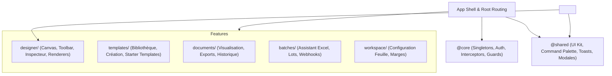

# Plan Stratégique de Modularisation du Frontend

> **Projet** : Moteur de Rapports — Plateforme de Conception & Génération de Documents  
> **Technologies** : Angular 21 (Standalone Components & Signals), Vite, SCSS, TypeScript 5.8  
> **Date** : Septembre 2026  
> **Statut** : Prêt pour exécution progressive sans régression  

---

## 1. Contexte & Diagnostic Architectural

Suite aux phases de stabilisation et de modernisation de l'UI/UX, le frontend bénéficie d'une base fonctionnelle solide, validée par **26 tests Playwright E2E** et **97 tests Spring Boot backend**.

Cependant, la croissance rapide de l'application a généré plusieurs goulets d'étranglement de modularité :

| Composant / Fichier | Taille Actuelle | Responsabilités Cumulées (Dette Technique) |
| :--- | :---: | :--- |
| [`ReportDesigner`](file:///d:/programme/Mera_Project/moteur-rapports/frontend/src/app/designer/report-designer/report-designer.ts) | **716 lignes** | Barre d'outils, raccourcis clavier, gestion multipages, magnétisme, zoom, export, onboarding, sélection multiple. |
| [`BlockPreview`](file:///d:/programme/Mera_Project/moteur-rapports/frontend/src/app/designer/block-preview/block-preview.ts) | **664 lignes** | Moteur de rendu HTML par concaténation de chaînes pour 11 types de blocs, calculs de pagination, iframe, redimensionnement. |
| [`starter-templates.data.ts`](file:///d:/programme/Mera_Project/moteur-rapports/frontend/src/app/templates/starter-templates/starter-templates.data.ts) | **1 591 lignes** | 7 modèles complets (JSON, blocs, styles, variables) concentrés dans un seul fichier statique de 56 Ko. |
| **Arborescence globale** | 13 dossiers à la racine | Mélange sans frontière claire entre infrastructures (`core`), composants partagés (`shared`) et modules métier (`features`). |
| **Imports TypeScript** | `../../../../...` | Chemins relatifs profonds, fragiles aux déplacements et difficiles à maintenir. |
| **Flux de données (Prop Drilling)** | 28 `@Input()` en cascade | Les propriétés de page transitent manuellement de `template-detail` vers `report-designer` puis vers `canvas` et `editor`. |

---

## 2. Architecture Cible : Clean Feature-Based Architecture

L'architecture cible repose sur les standards modernes d'Angular 21 (approche modulaire par domaine avec Standalone Components et Signals) :



---

## 3. Les 4 Piliers de la Modularisation

### 🏛️ Pilier 1 : Organisation en Couches & Path Aliases TypeScript

#### Objectifs :
- Éliminer tous les imports relatifs profonds (`../../../`).
- Définir des frontières strictes entre domaines.

#### Actions concrètes :
1. Configuration des alias dans `tsconfig.json` :
   ```json
   "paths": {
     "@core/*": ["src/app/core/*"],
     "@shared/*": ["src/app/shared/*"],
     "@designer/*": ["src/app/designer/*"],
     "@models/*": ["src/app/models/*"],
     "@services/*": ["src/app/services/*"]
   }
   ```
2. Structuration des 3 couches :
   - **`src/app/core/`** : Services d'authentification (`AuthService`), Intercepteurs HTTP (`jwt.interceptor`), Guards (`auth.guard`), configuration globale.
   - **`src/app/shared/`** : Composants réutilisables (`CommandPaletteComponent`, `ToastContainerComponent`, modales génériques), directives, pipes.
   - **`src/app/features/`** : Regroupement cohérent des modules fonctionnels (`designer`, `templates`, `documents`, `batches`, `workspace-config`).

---

### 🧩 Pilier 2 : Découpage des Composants Monolithiques (God Components)

#### A. Découpage de `ReportDesigner` (716 lignes ➔ 3 micro-composants)
- **`DesignerToolbarComponent`** :
  - Isolera la barre supérieure (Undo/Redo, Alignements, Zoom, Repères magnétiques, Bouton de sauvegarde pulsante).
  - Allège `ReportDesigner` d'environ 200 lignes de template et 150 lignes de TypeScript.
- **`DesignerPageTabsComponent`** :
  - Gère la barre des onglets multipages (Ajouter une page, Dupliquer, Renommer in-place, Supprimer).
- **`DesignerShortcutsService`** :
  - Service dédié pour capturer et centraliser les raccourcis clavier (<kbd>Ctrl+Z</kbd>, <kbd>Ctrl+Y</kbd>, <kbd>Ctrl+C</kbd>, <kbd>Ctrl+V</kbd>, <kbd>Suppr</kbd>).

#### B. Découpage de `starter-templates.data.ts` (1 591 lignes ➔ 7 modules isolés)
- Remplacer le fichier géant par un dossier `starter-templates/templates/` contenant :
  1. `facture-commerciale.template.ts`
  2. `devis-commercial.template.ts`
  3. `attestation-formation.template.ts`
  4. `rapport-audit.template.ts`
  5. `bulletin-paie.template.ts`
  6. `rapport-avancement.template.ts`
  7. `bon-commande.template.ts`
  - Un fichier index `index.ts` exportant le tableau complet `STARTER_TEMPLATES`.
  - **Gain** : Clarté immédiate, modification d'un gabarit sans risque d'altérer les autres, possibilité de chargement à la demande (*lazy-loading* des gabarits).

#### C. Moteur de Rendu Modulaire dans `BlockPreview` (Pattern Stratégie / Renderers)
- Remplacer le gros `switch(block.type)` par des renderers modulaires implémentant une interface commune :
  ```typescript
  export interface BlockHtmlRenderer {
    supports(type: string): boolean;
    render(block: DesignBlock, context: RenderContext): string;
  }
  ```
- Renderers isolés :
  - `TableBlockRenderer` (gère tableaux fixes et dynamiques avec pagination).
  - `ChartBlockRenderer` (gère les graphiques vectoriels et donuts).
  - `TextBlockRenderer` (gère titres, paragraphes et autocomplétion).
  - `BarcodeBlockRenderer` (gère QR Codes et codes-barres).
- **Gain** : Ajouter un nouveau type de bloc (ex: carte, signature, sommaire) se fait en ajoutant **un seul fichier** sans toucher au reste.

---

### ⚡ Pilier 3 : Gestion d'État Réactive moderne avec Signals (Angular 21)

#### Objectifs :
- Éliminer le passage de 28 `@Input()` en chaîne (*prop-drilling*).
- Supprimer les appels manuels à `ChangeDetectorRef.detectChanges()`.
- Éliminer définitivement les risques d'erreurs `NG0100`.

#### Architecture du Store Réactif :
Création d'un service d'état léger par domaine (ex: `DesignerStore`) s'appuyant sur les signaux natifs :
```typescript
@Injectable({ providedIn: 'root' })
export class DesignerStore {
  // État Réactif
  readonly activePage = signal<number>(0);
  readonly selectedBlockIds = signal<string[]>([]);
  readonly zoom = signal<number>(1.0);
  readonly savingStatus = signal<'idle' | 'saving' | 'saved'>('idle');

  // Signaux Dérivés (Computed)
  readonly isMultiSelected = computed(() => this.selectedBlockIds().length > 1);
  readonly canUndo = computed(() => this.historyIndex() > 0);
}
```

---

### 📦 Pilier 4 : Encapsulation & Autonomie du Web Component (`<report-designer-widget>`)

#### Objectifs :
- Garantir que le Web Component SDK ne charge que le cœur du designer et ses composants partagés, sans dépendre des modules de routage complet, d'administration ou de configuration d'entreprise.
- Fournir une API publique documentée pour l'intégration dans des progiciels tiers (ERP, CRM, SaaS).

---

## 4. Feuille de Route & Phasage d'Exécution

| Phase | Intitulé | Tâches Clés | Risque | Statut |
| :---: | :--- | :--- | :--- | :---: |
| **Phase 1** | **Fondations & Découpage Statique** | • Mise en place des Path Aliases TypeScript (`@core`, `@shared`, `@designer`, `@models`, `@services`, `@templates`)<br>• Découpage de `starter-templates.data.ts` (1 590 lignes ➔ 6 fichiers modulaires + barrel)<br>• Déplacement des composants orphelins (`code-entreprise-modal` ➔ `@shared/components/`) | Faible | **Terminé ✅** |
| **Phase 2** | **Découpage de l'Éditeur (`ReportDesigner`)** | • Extraction de `DesignerToolbarComponent`<br>• Extraction de `DesignerPageTabsComponent`<br>• Découpage propre des templates et SCSS | Modéré | **Terminé ✅** |
| **Phase 3** | **Moteur de Rendu Modulaire (`BlockPreview`)** | • Création de l'interface `BlockHtmlRenderer`<br>• Extraction des renderers spécialisés (`TableBlockRenderer`, `ChartBlockRenderer`, `TextBlockRenderer`, `ShapeBlockRenderer`, `BarcodeBlockRenderer`)<br>• Allègement drastique de `block-preview.ts` via le Pattern Stratégie | Modéré | **Terminé ✅** |
| **Phase 4** | **Réactivité Signals & Isolation SDK** | • Introduction du `DesignerStore` à base de Signals Angular 21<br>• Réduction drastique du *prop-drilling* sur `template-detail`<br>• Validation de l'isolation du package `<report-designer-widget>` | Faible | Planifié |
| **Phase 5** | **Barrels & Documentation Publique** | • Barrels `@shared/index`, `@shared/components/index`, `@shared/services/index`, `@designer/index`<br>• Mise à jour de la documentation d'architecture (`frontend/README.md`) | Faible | **Terminé ✅** |

---

## 5. Critères de Validation & Garantie de Non-Régression

À chaque étape de refactorisation :
1. **Compilation Frontend** : `npm run build` doit se terminer avec **Code 0** et **0 warning**.
2. **Suite de Tests E2E Playwright** : Les **26 tests de bout en bout** (`npx playwright test`) doivent rester **100 % au vert**.
3. **Suite de Tests Backend JUnit** : Les **97 tests Spring Boot** (`mvn test`) doivent rester **100 % passants**.

